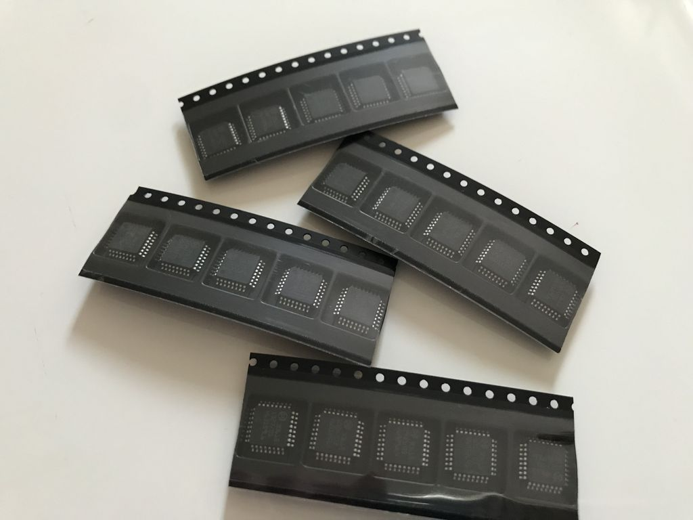

# Dual channel wideband oxygen controller

## Development status

- Hardware: working in progress, check hardware/V0.0.1 for actual status
- Software: not started yet

### Dual WBO controller based on

- Microchip AT90CAN128
- 2x Bosch CJ125 wideband lambda controller
- NXP TJA1050T high speed can transceiver
- Infineon TLE42754D LDO 5v and 450mA
- Analog Devices AD5337 8-bit DAC
- Analog Devices ADR02 5v and 10mA precision reference (0.1%) for TLS115
- Infineon TLS115B0EJ voltage tracker for analog part, provides 5v and 150mA
- ...

### Features

- supports **LSU4.9** probes only
- Automotive grade components
- 2x LSU 4.9 connector (TE 1813139-1)
- 4 layer PCB
- integrated with TunerStudio

### Inputs

- 2x LSU4.9 probes
- CAN HS with up to 1mbit/s
- UART for configuration
- UBat input for activation the controller

### Outputs

- dual analog output, either as 0..5V for Lambda 0.65 to 1.35 **OR** narrow band emulation
- CAN output (AEM X-Series protocol) for both channels and debug messages

### Bosch CJ125 (LQFP32 package) part numbers

|Bosch part number|
|:----------------|
|30615|
|40103|
|30522|

#### A couple of CJ125 ICs

### Suitable Bosch lambda probes

Basically, the Bosch probes whose numbers start with **0 258 017** will fit, also Bosch **0 281 004**.  
Bosch numbers beginning with **0 258 007** are *LSU 4.2* probes and will not fit.

|Bosch number  |Length overall|Comment|
|--------------|--------------|-------|
|0 258 017 012 |1060mm||
|0 258 017 025 |1000mm|Bosch motorsport part|
|0 258 017 029 |620mm|grey, used by BMW after 09/2006 (1178 7539124)|
|0 258 017 038 |340mm|grey, used by BMW (11787537984)|
|0 258 017 092 |950mm|black, used by BMW (1178 7540167)|
|0 258 017 126 |680mm|black, used by BMW after 09/2006 (1178 7561410)|
|0 281 004 028 |540mm||
|0 281 004 150 |1215mm||
|0 281 004 184 |1000mm||
|...|||

### LSU4.9 probe pinout

|Pin#|Color|Description|Symbol|
|----|-----|--------|-----------|
|1|red|Pump current APE|IP|
|2|yellow|Virtual ground IPN|VM|
|3|white|Heater voltage H-|Uh-|
|4|grey|Heater voltaget H+|Uh+|
|5|green|Trim Resistor RT|IA|
|6|black|Nernst voltage UN|RE|
